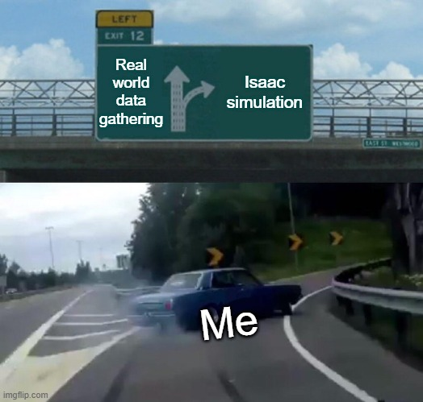

### **Isaac Sim Helper Repository**

This repository contains helpful scripts and examples for working with NVIDIA's Isaac Sim.

---

### **1. Interactive Examples**

Find interactive examples for common tasks using Isaac Sim, including:

* **Replicator Agent:** Control a Replicator agent via Python.
* **Robot Control:** Scripts for controlling robots.
* **Scene Management:** Examples for loading scenes and recording data.
* **Video Export:** Export recorded camera footage to a video file.

For a specific example of multicamera recording, see the script at `src/examples/record_multicam`.

---

### **2. Data Generation**

This section focuses on generating data for 3D pose estimation, specifically 3D bounding boxes and 3D semantic points.

* **Data Generation for Pose Estimation:** The scripts here generate data used for **keypoints-PnP based pose estimation**.
* **Writers:** For detailed information on the data generation process, refer to the README file located at `src/replicator/writers/README.md`.
* **Output Data:** An example of the generated data can be found in the `data/3d_semantic_point` directory.